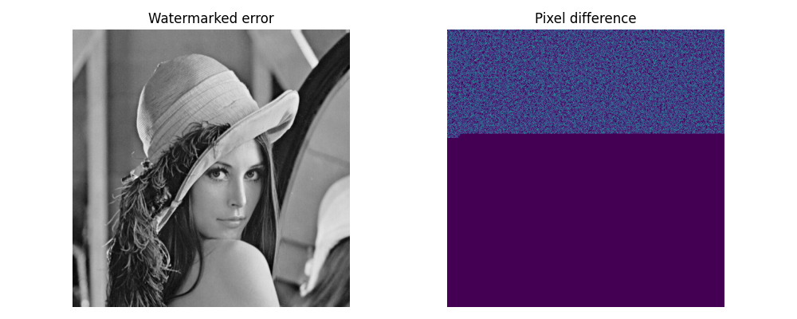

# Watermarking with DCT

This repository contains a naïve implementaton of the DCT watermarking technique, with a simple class with very few dependencies (`opencv` and `numpy`)

Useful resources:

- [Image watermarking using DCT domain constraints, Adrian Bors](https://ieeexplore.ieee.org/document/560426)
- [Embedding and Extracting Digital Watermark
Based on DCT Algorithm](https://www.scirp.org/pdf/JCC_2018112716073465.pdf)
-  [Wikipedia: Discrete Cosine Transform](https://en.wikipedia.org/wiki/Discrete_cosine_transform)

Compared to LSB, which is easily detected, and which can be easily corrupted with image compression, the DCT is not straightforward.


# How to use ?

This is a watermarking tool, that can perform two things:

- **Encode**: Given an image and a bytestring, watermark the image with the info.
- **Decode**: Given the raw image and the watermarked image, retrieve the watermark


**_Notes_**:

- The watermark is not visible
- It can degrade a bit the image quality
- Only the owner of the original document (without the watermark) can decode the message.


## Code

In `watermarker.py`, we have one module.

There is no `setup.py`, so you need to take the file `watermarker.py` somewhere accessible from your code.


Check the notebook to run a true example.

Nevertheless, a quick starting code is the following:

```python
# To encode a message
from watermarker import BlockMark
import cv2

my_img = cv2.imread("path_to_img.png", 0) # 0 to get only one channel
my_message = [0, 1, 0, 0, 1]

md = BlockMark()

my_watermarked_img = md.encode(my_img, my_message)
cv2.imsave(my_watermarked_img, "watermarked.png")
```

To decode the watermark:
```python
from watermarker import BlockMark
import cv2

my_img = cv2.imread("path_to_img.png", 0) # 0 to get only one channel
my_watermarked_img = cv2.imread("watermarked.png", 0)


md = BlockMark()
decoded_message = md.decode(my_img, my_watermarked_img)
print(decoded_message)
```

Check `playground.ipynb` for a practical example.


**Note**: To decode a message, the class `BlockMark()` should be configured with the same arguments.


# How it works 

**Encoding**:

0. The watermark can be anything. It is represented as a bit string made of `{0, 1}`.
1. The image is cut into non-overlaping block of size `8x8` (Modifying DCT coefficient obtained on the complete image will lead to visible artefact)
2. In each block, we focus on mid-frequency coefficients
3. Each of these coefficients is modified to embed the watermark information
4. The modified DCT coefficients are transformed back to pixels space
5. Original image is replaced by the recomputed pixels.
6.  


## Getting Mid frequency coefficients

Here, we use all mid frequency coefficients.


- Modifying Low frequency (highly visible coefficients) would distort the original image
- Modifying High frequency coefficients (almost not visible), the watermark will be removed after a very slight compression, or even after pixel quantization.

For a custom block size (`k x k`), the coefficients used are those where the manhatan distance to origin is greater or equal to `k/2` and lower than `k` for simplicity.


## Block Operation

There are two possible operations: Addition and Multiplication.

In our current version, it is advised to use the addition only (because we would not have division by zero error for instance).
Nevertheless, Multiplicative approach seems better as it better adapt to contrast.

### Addition 

A coefficient `f` will embed information `w` with strenght `a` as:

`f' = f + aw`

To recover the information during decoding, we compute `w` as:

`w = (f' - f) / a`

### Multiplication

A coefficient `f` will embed information `w` with strenght `a` as:

`f' = f x (1 + aw)`

To recover the information during decoding, we compute `w` as:

`w = (f'/f - 1)/ a`

In that case, we must ensure that `f` is different from `0`. (This is not done in our current code, so we get some recovery errors).


## Coefficient selection

How to select `a` (`alpha` in our code) ?

First, internaly, our class maps the sequence of bits to `{-1, 1}`, as DCT coefficients are either positive or negative, to keep the weights balanced.

When we call the method `.decode()`, we do the inverse operation (e.g., inverse of the addition ) and binarize the results to give the user a binary sequence back.
We can have access to the non-quantized data by setting `.decode(quantization=False)`.
Thanks to that, we can plot the several histograms for different values of `alpha`:


CCL:

- When alpha is small, there is a risk that the two distributions overlap.
- When alpha is large, the risk is reduced. However, the watermarking is more visible as the pixel difference increase.

Here are the error/noise table results:

| Alpha | MSE | PSNR | Accuracy |
|-------|------|--------|-------|
| 1     | 0.5  |  51 dB | 95.6 % |
| 2     | 1.7  |  45 dB | 99.9 % |
| 4     | 6.6  |  40 dB | 100 %  |


For `alpha=2`, the watermarking effect is very limited, we cannot even see the limit between watermarked blocks and non-marked blocks.




## DCT VS LSB 

One advantage of DCT over LSB is the naturalness of the histogram.

On Lena, the histogram is quite spiky on the dark region.
The watermarking here will blur the histogram, improving its naturalness.
Therefore, it seems that the image was not modified.


You can compare to LSB histograms in ["Comparative Histogram Analysis of LSB-based Image Steganography"](https://www.wseas.org/multimedia/journals/control/2018/a265903-043.pdf)


---- 

# TODO

## Masking 

In a `8x8` block, we have `22` slots.
If you do not want to use some, send `0.5` in the `{0, 1}` list so it will be converted as `0` and the coefficient will not be modified.


## Compression resilience

In the first tests, the watermark is easily removed (JPEG 80%, alpha=2).
Need to do some additional testing to find the best trade-off.

Also, when compressing the image, to recover the watermark, we should use both the raw version and the compressed version.

- The compressed version helps to find the end of the watermarked blocks
- The raw version is better to help recovering coefficients.


